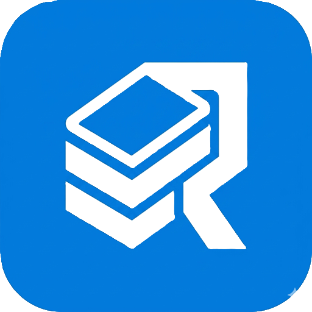

# RimeDeck

Local-first AI agent workbench — manage issues, orchestrate AI coding agents, and run deterministic SOPs (Standard Operating Procedures), all in one desktop app. Zero Docker, zero cloud dependency. Forked from [Multica](https://github.com/multica-ai/multica).

<details>
<summary>📸 Screenshot 1</summary>

</details>

<details>
<summary>📸 Screenshot 2</summary>

</details>

---

## Why RimeDeck

**Zero Docker, zero cloud.** RimeDeck embeds PostgreSQL and the Go server as Electron child processes. Double-click to launch — the app starts the database, runs migrations, spawns the server, and opens the UI. No containers, no remote API, no manual setup.

**Compute sharing.** Add remote machines as headless compute nodes over LAN / Tailscale / VPN. The remote daemon claims and runs agent tasks via a scoped daemon token — contributing GPU/CPU without accessing the workspace UI.

**Remote collaboration.** Invite team members to your workspace with full UI access — issues, agents, runtimes, settings — authenticated via JWT, exactly like a cloud app but running on your own machine.

### RimeDeck vs Multica

RimeDeck is forked from [Multica](https://github.com/multica-ai/multica). The table below highlights where RimeDeck diverges:

| Dimension | Multica | RimeDeck |
|-----------|---------|----------|
| **Deployment** | Docker Compose / Cloud SaaS | Zero Docker — Electron bundles PostgreSQL + Go server as child processes; double-click to launch |
| **Cloud dependency** | Cloud-first; self-hosting via Docker | Fully offline, zero cloud requirement |
| **Database** | External PostgreSQL (Docker or managed) | Embedded PostgreSQL, auto-migrated on startup |
| **Deterministic pipelines** | — | SOP-as-MCP: RuleGo DAG engine (HTTP → LLM → filter → doc gen); non-LLM nodes run at zero token cost |
| **SOP injection** | — | Dual-path: runtime config file + MCP tool; agent decides autonomously when to trigger |
| **Compute sharing** | Cloud runtimes + local daemon | LAN / Tailscale / VPN daemon tokens — remote machines contribute GPU/CPU without UI access |
| **Remote collaboration** | Cloud workspace membership | Peer-to-peer JWT auth — collaborator's Electron UI points at your server's API directly |
| **Supported runtimes** | 13 | 16 (adds CodeBuddy, Antigravity, Qwen Code) |
| **Issue / Project views** | 4 views: Board, List, Gantt, Swimlane | 7 views: + Analytics, Calendar, DAG dependency graph |
| **WSL runtime support** | — | Windows desktop auto-discovers WSL distros, bundles Linux CLI binaries, and manages WSL daemons (start/stop/status) from the Electron UI |
| **Squad leader template** | Must pick an existing agent as leader | Built-in Agent Manager template — one-click creates a leader that routes tasks, coordinates members, and summarizes results |

### Agent = Person, Skill = Knowledge, SOP = Capability

| Layer | What it is | How it's delivered |
|-------|-----------|-------------------|
| **Agent** | An AI entity with identity, model, and instructions | Bound to one of 16 runtime CLIs |
| **Skill** | Reusable knowledge (code review checklist, conventions) | Injected into system prompt — passive knowledge |
| **SOP** | A deterministic DAG pipeline (HTTP → LLM → filter → doc gen) | Injected into runtime config — active capability the agent calls on demand |

### SOP-as-MCP: Agent-Triggered Deterministic Pipelines

SOPs are pre-built DAGs executed server-side by the [RuleGo](https://github.com/rulego/rulego) engine. Non-LLM nodes run at **zero token cost**; only LLM nodes consume tokens. Dual-path injection ensures all 16 runtimes discover SOPs:

```
Path 1 (primary):  SOP list → CLAUDE.md / AGENTS.md → agent reads natively
Path 2 (auxiliary): SOP MCP server → McpConfig → agent sees trigger_sop tool
```

The agent **decides autonomously** whether to trigger an SOP — no server-side intent matching or hardcoded commands.

### Squad-Based Multi-Agent Orchestration

A **Squad** is a team with one leader agent and member agents/users. The leader claims issues, breaks work down, and delegates sub-tasks via `@mention` — no centralized orchestrator, just agent-to-agent communication on the issue thread.

---

## Architecture

```
┌───────────────────────────────────────────────────────────────┐
│                       RimeDeck App                             │
│  ┌──────────┐  ┌──────────┐  ┌──────────┐  ┌──────────────┐  │
│  │ Electron │  │ Go Server│  │PostgreSQL│  │   Daemon     │  │
│  │   (UI)   │◄►│  (API)   │◄►│  (Data)  │  │(Task Runner) │  │
│  └──────────┘  └──────────┘  └──────────┘  └──────┬───────┘  │
└───────────────────────────────────────────────────┼───────────┘
                                                    │
         ┌──────────────────────────────────────────┤
         ▼                                          ▼
  ┌─────────────┐                           ┌─────────────┐
  │   Agent A   │                           │   Agent B   │
  │ claude CLI  │                           │ codex CLI   │
  │             │                           │             │
  │ Skills: ────┤  injected into            │ Skills: ────┤
  │  Go Review  │  CLAUDE.md / AGENTS.md    │  TS Expert  │
  │  Security   │                           │  Test TDD   │
  │             │                           │             │
  │ SOPs: ──────┤  listed in runtime config │ SOPs: ──────┤
  │  monitors   │  + MCP tool (if supported)│weekly report │
  └─────────────┘                           └─────────────┘
         │                                          │
         ▼                                          ▼
  ┌─────────────────────────────────────────────────────┐
  │              RuleGo Engine (embedded)                │
  │  restApiCall · jsFilter · agentLLM · docGenerate    │
  │  webScrape · rssFetch · spreadsheet · sendEmail     │
  └─────────────────────────────────────────────────────┘
```

### Compute Sharing

Add a remote machine as a headless compute node. It runs agent tasks but has no workspace UI access.

```
Machine A (Server)                    Machine C (Compute Node)
┌──────────────────────┐              ┌──────────────────────┐
│  RimeDeck Desktop    │              │  RimeDeck Desktop    │
│  ┌────────────────┐  │              │                      │
│  │ UI (Electron)  │  │              │  (UI stays on local  │
│  │ issues, agents │  │              │   workspace — unused │
│  └────────────────┘  │              │   for this server)   │
│  ┌────────────────┐  │   daemon     │  ┌────────────────┐  │
│  │ Server + PG    │◄─┼── token ────┼──│ Daemon          │  │
│  │ workspace data │  │  (mdt_)      │  │ claims & runs   │  │
│  └────────────────┘  │              │  │ tasks only      │  │
│  ┌────────────────┐  │              │  └────────────────┘  │
│  │ Local Daemon   │  │              └──────────────────────┘
│  └────────────────┘  │
└──────────────────────┘
```

### Remote Collaboration

Invite a person as a workspace member. Their Desktop UI switches to your server's API — full access to issues, agents, and settings.

```
Machine A (Server)                    Machine B (Collaborator)
┌──────────────────────┐              ┌──────────────────────┐
│  RimeDeck Desktop    │              │  RimeDeck Desktop    │
│  ┌────────────────┐  │              │  ┌────────────────┐  │
│  │ UI (Electron)  │  │   JWT /      │  │ UI (Electron)  │  │
│  │ issues, agents │  │   session    │  │ issues, agents │  │
│  └────────────────┘  │◄────────────►│  │ (same data!)   │  │
│  ┌────────────────┐  │              │  └────────────────┘  │
│  │ Server + PG    │◄─┼── all API ──┼──    /api/*           │
│  │ workspace data │  │              │                      │
│  └────────────────┘  │              │  Local server idles  │
│  ┌────────────────┐  │              │  (data preserved)    │
│  │ Local Daemon   │  │              └──────────────────────┘
│  └────────────────┘  │
└──────────────────────┘
```


---

## Supported Runtimes

RimeDeck supports 16 AI coding tools as agent runtimes. The daemon auto-detects installed CLIs on your machine.

| Runtime | CLI | Provider |
|---------|-----|----------|
| Antigravity | `agy` | Google |
| Claude Code | `claude` | Anthropic |
| CodeBuddy | `codebuddy` | Tencent |
| Codex | `codex` | OpenAI |
| Copilot | `copilot` | GitHub / Microsoft |
| Cursor | `cursor-agent` | Cursor |
| Gemini CLI | `gemini` | Google |
| Hermes | `hermes` | NousResearch |
| Kimi | `kimi` | Moonshot AI |
| Kiro CLI | `kiro-cli` | Amazon |
| OMP | `omp` | Community |
| OpenCode | `opencode` | Community |
| OpenClaw | `openclaw` | Community |
| Pi | `pi` | Community |
| Qoder | `qoder` | Qodo |
| Qwen Code | `qwen-code` | Alibaba |

All runtimes share one `Backend` interface — skills, SOPs, MCP config, and system prompts are injected uniformly.

---
## Quick Start

**Prerequisites**: Node.js 22+, pnpm 10+, Go 1.24+, PostgreSQL 17

```bash
pnpm install
make dev          # auto-creates env, starts DB, migrates, launches everything
```

### Desktop App

```bash
pnpm dev:desktop                          # dev mode with HMR
pnpm --filter @rimedeck/desktop package   # build for current platform
```

The desktop build bundles Go CLI + embedded PostgreSQL — runs fully offline.

---

## Project Structure

```
apps/desktop/     Electron desktop app
packages/core/    Headless business logic (zero react-dom)
packages/ui/      Atomic UI components (shadcn)
packages/views/   Shared business pages
server/           Go backend (Chi, sqlc, RuleGo, gorilla/ws)
  internal/
    handler/      HTTP handlers (REST API)
    service/      Business logic (SOP engine, task queue, autopilot)
    daemon/       Task runner + runtime config injection
    workflow/     SOP templates + n8n/Dify importers
  pkg/agent/      16 runtime backends (unified Backend interface)
  migrations/     PostgreSQL migrations (127 applied)
```

## License

See [LICENSE](LICENSE).
