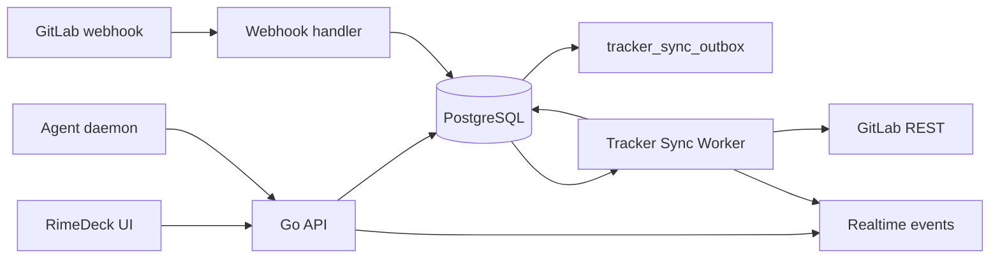

# RimeDeck 项目混合 Issue 与 GitLab 同步设计

- 状态：提案，v3（GitLab-only 收敛版，2026-08-15）。
- 范围：一个 RimeDeck project 可同时拥有本地 Issue 与 GitLab 远端 Issue 的本地镜像；代码执行目录与 Issue tracker 独立配置。
- 明确不做：**不触碰任何 GitHub 代码路径**。现有 workspace GitHub App / PR 镜像 / Settings GitHub tab 保持原样；本设计不新增 GitHub tracker、不改 GitHub webhook、不改 PR auto-link。
- 核心决策：**所有 Issue 读写首先且只通过 RimeDeck API 与其嵌入式 PostgreSQL。UI、Kanban、agent/daemon 都不直接访问 GitLab，也不直接读写数据库。**daemon 仍通过现有 RimeDeck API 使用本地 Issue UUID；远端同步由后端 Tracker Sync Worker 通过可审计 outbox 异步完成。

## 1. 已确认需求（v3）

1. 每个 project 的 Issue 列表、查询、创建、编辑、筛选、拖拽和 agent 任务都基于 RimeDeck 本地数据库；页面不直接请求远端仓库。
2. 一个 project 可同时包含：RimeDeck 本地 Issue；GitLab 远端 Issue 的本地镜像。两者在同一 Kanban 共存。
3. GitLab 来源的 Issue 必须有可见来源区分，并可按 `本地 / GitLab / 某个 GitLab 仓库` 筛选。
4. 新建 Issue 时必须选择来源：`本地 Issue` 或项目已配置的某个 GitLab tracker。
5. 两种入口建立 tracker：
   - 创建项目时选择 GitLab 仓库作为代码源（附带 tracker）；
   - 导入本地文件夹项目后，若该目录连着 GitLab 远端（或手动填写），补配 tracker。
6. 对 GitLab 来源 Issue 的本地修改先写数据库并进入同步队列；worker 再推送到远端。远端不可用时保留本地操作、展示待同步/失败状态、按退避重试。

“基于 daemon 数据库操作”按现有架构解释为“基于 desktop 启动的 Go Server + 嵌入式 PostgreSQL”：daemon 不是数据库客户端，不新增 daemon 直连 PostgreSQL 路径。

## 2. 当前架构约束

- 项目代码来源由 `project_resource` 表达，已有 `github_repo` 和 `local_directory`；Kanban 各视图只消费本地 `GET /api/issues`；Issue、标签缓存、WebSocket、agent task 都以本地 Issue UUID 为主键。因此不新增"远端 Kanban 数据源"——远端 Issue 一律先归一化为本地 `issue` 行。
- 现有 workspace 级 GitHub App 集成（`github_installation`、`github_pull_request`、`issue_pull_request`、`/api/webhooks/github`）是 PR 镜像 + auto-link，不是 Issue tracker，且不在本期改动范围。共存规则见 §12。
- 现有 `issue_label` 为 workspace 级 `(workspace_id, lower(name))` 唯一，不能表达两个 GitLab 项目同名异色标签。

GitLab REST API 关键事实：

- API 根为 `<instance>/api/v4`；project path 作为参数必须 URL 编码。[GitLab REST API](https://docs.gitlab.com/api/rest/)
- Issue 用项目内 `iid` 标识，创建/更新/删除端点为 `/projects/:id/issues/:iid`；不能用全局 `id` 替代 `iid`。[Issues API](https://docs.gitlab.com/api/issues/)
- state 只有 `opened/closed`。[Issues API](https://docs.gitlab.com/api/issues/)
- project labels 含祖先组标签，需独立分页拉取。[Project Labels API](https://docs.gitlab.com/api/labels/)
- webhook 是低延迟提示而非正确性来源；定时 reconcile 必须补偿漏投递、乱序、远端删除。[Project webhooks API](https://docs.gitlab.com/api/project_webhooks/)

## 3. 方案比较与结论

| 方案 | 描述 | 问题 / 收益 |
| --- | --- | --- |
| 前端直连 GitLab | Kanban 按来源直接调用 GitLab API | token 暴露；两套缓存；断网不可写；agent 无本地 UUID；拒绝 |
| 同步请求代理 | 每个 Issue API 请求先调 GitLab 再写 DB | 所有操作被网络阻塞；GitLab 故障时无法记录本地工作；违背需求 1 |
| **本地数据库 + 异步 outbox** | **所有命令先提交 PostgreSQL；worker 拉/推 GitLab；webhook + reconcile 收敛** | **离线优先、混合来源、复用既有 Kanban/agent；代价是可见的最终一致性** |

决策：本地数据库为写入权威，outbox 异步同步。“GitLab 权威”只适用于 GitLab 管理字段的最终收敛——用户每次操作先得到本地已提交结果，远端成功后置 `synced`，失败则保留本地修改并标记失败、可重试。

## 4. 概念模型：执行代码与 Issue Tracker 解耦

| 维度 | 作用 | 模型 |
| --- | --- | --- |
| **代码工作目录** | daemon/agent 在哪执行、如何 checkout | 现有 `project_resource`：`local_directory`、`github_repo`；新增 `gitlab_repo`（无凭据 clone URL） |
| **Issue Tracker** | 哪些远端 Issue 需镜像、本地变更同步到哪 | 新增 `gitlab_tracker_connection`，project `0..N` 个 |

一个 project 可以连接多个 GitLab tracker（如 frontend/backend 两个 GitLab repo），每个远端 Issue 只属于一个 connection。本地文件夹 project 同样可连接 GitLab tracker——代码目录与 Issue 来源是两个独立决定。

### 4.1 创建项目流程

| 代码源 tab | 输入 | 结果 |
| --- | --- | --- |
| GitHub（现有，不动） | 仓库多选/URL | 现有 `github_repo` 资源；**不配 tracker** |
| GitLab | GitLab 项目 URL + access token | `gitlab_repo` 资源 + GitLab tracker connection，创建后自动首次导入 |
| 本地 | desktop 目录选择器 | `local_directory` 资源；检测到 GitLab remote 时可补配 tracker |

本地目录选择后：

1. Electron 用现有目录校验；额外只读探测 `git remote -v`，不写目录、不写 token 进 Git config。
2. 若 `origin` 指向 GitLab（按 host 匹配 gitlab.com 或自托管 allowlist），预填仓库 URL；用户可改、可跳过。
3. 用户填 token 并验证成功 → 项目创建后建立 connection 并开始首次导入；跳过 → 纯本地项目，之后仍可从项目设置补配。
4. 目录不是 Git 仓库或 remote 非 GitLab → 仍允许手动输入 GitLab 仓库 URL + token。

代码 resource 只保存无密钥 clone URL。tracker token 永不进入 `resource_ref`、工作目录、Git remote、daemon task、agent prompt、sidecar 文件。

## 5. 用户界面

### 5.1 项目 Tracker 设置

项目详情 Resources 旁新增 **Issue trackers** 区域：

- 每条 connection 显示 GitLab 图标、`namespace/project`、web URL、连接状态、token 已配置、上次同步、pending/failed outbox 计数、同步按钮。
- owner/admin 可新增、轮换 token、禁用/重新启用、立即同步、断开；普通成员只读。
- 断开 = 软禁用：connection 行保留为 `disabled`，镜像 Issue 转为 `source_type=detached, sync_state=detached`，remote link 保留用于 badge/外链。仍有镜像 Issue/远端标签/非终态 outbox 时禁止物理删除。独立“删除镜像数据”动作（二次确认）先删镜像与 outbox，再删 connection。

### 5.2 Kanban 来源区分

卡片、List 行、详情 header、Command-K 结果显示来源 badge：

| 来源 | Badge | 交互 |
| --- | --- | --- |
| `local` | `Local` 中性灰 | 无外链 |
| `gitlab` | GitLab mark + `#iid` | 链接 `web_url`；显示同步状态 |
| `detached` | 淡色 GitLab badge + `Detached` | 保留原外链 |

同步状态独立小标识：`synced / pending / syncing / failed / pending_delete / detached`。

### 5.3 筛选

Issues Header 过滤器新增“来源”子菜单：全部（默认）/ 本地 / GitLab / 各 tracker 具体仓库 / 同步失败 / 待同步，可组合。

```text
GET /api/issues?project_id=<id>&source=local
GET /api/issues?project_id=<id>&source=gitlab&tracker_id=<id>&sync_state=failed
```

Board/List/Gantt/Swimlane/Analytics/Calendar/DAG 全部基于同一 `GET /api/issues`，不建 provider 专属 Query cache。

### 5.4 新建 Issue

Create Issue dialog 在 project 已选定时显示必填**来源** picker：

1. `本地 Issue`：无 outbox；工作区本地标签；项目存在 active tracker 时不预选。
2. `GitLab · <namespace/project>`：每个 active tracker 一项；创建本地 Issue + `create_issue` outbox。

规则：无 tracker 时只有本地项；有 tracker 时必须显式选择，不记忆默认值。远端来源提交后立即显示 pending badge，本地 UUID 可立即分配给 agent。远端 create 永久失败 → Issue 保留、`failed`、可 Retry 或“转换为本地”；本地 Issue 可通过显式“发布到 tracker”升格（不改 UUID）。

## 6. 架构



- **Go API handlers**：Issue/label CRUD 只写 PostgreSQL；按 source 追加 outbox；提交后发既有 realtime event。
- **`internal/gitlabtracker`**：GitLab 专用 client（自持 base URL，不复用 `githubAPIBase` 全局变量）、URL 解析、加密、SSRF guard、错误分类、字段映射。
- **Tracker Sync Worker**：消费 outbox、按 connection 串行、指数退避、更新 link/sync state、发同步结果事件。
- **Webhook handler**：验 `X-Gitlab-Token`、去重、只追加 `pull_issue`/`pull_labels` outbox；不在 HTTP 请求内回源。
- **Reconcile scheduler**：每 5 分钟增量 pull、每 6 小时全量校验。
- **daemon/agent**：只调 RimeDeck API；不直连 PostgreSQL、不读 tracker token、不访问 GitLab。

## 7. 数据模型

### 7.1 GitLab tracker connection

```sql
CREATE TABLE gitlab_tracker_connection (
  id                        UUID PRIMARY KEY DEFAULT gen_random_uuid(),
  project_id                UUID NOT NULL REFERENCES project(id) ON DELETE CASCADE,
  workspace_id              UUID NOT NULL REFERENCES workspace(id) ON DELETE CASCADE,
  instance_url              TEXT NOT NULL,
  remote_project_id         BIGINT NOT NULL,
  path_with_namespace       TEXT NOT NULL,
  web_url                   TEXT NOT NULL,
  clone_url                 TEXT NOT NULL,
  default_branch            TEXT,
  token_ciphertext          BYTEA NOT NULL,
  token_key_version         SMALLINT NOT NULL,
  webhook_secret_ciphertext BYTEA NOT NULL,
  webhook_id                BIGINT,
  webhook_state             TEXT NOT NULL CHECK (webhook_state IN ('active','unavailable','error')),
  state                     TEXT NOT NULL CHECK (state IN ('active','degraded','disabled')),
  last_pull_at              TIMESTAMPTZ,
  last_full_reconcile_at    TIMESTAMPTZ,
  last_error_code           TEXT,
  last_error_at             TIMESTAMPTZ,
  created_by                UUID NOT NULL REFERENCES "user"(id),
  created_at                TIMESTAMPTZ NOT NULL DEFAULT now(),
  updated_at                TIMESTAMPTZ NOT NULL DEFAULT now(),
  UNIQUE (project_id, instance_url, remote_project_id)
);
```

- `instance_url` 为 GitLab host；`remote_project_id` 为 GitLab project numeric ID；`path_with_namespace` 支持 group/subgroup/project。
- token 需 `api` scope（读 project/issue/label + 写 issue）。webhook 建立需项目 Maintainer/Owner；无权限或无 `PUBLIC_URL` 时 `webhook_state=unavailable`，不阻塞创建，reconcile 兜底。
- connection 软禁用；存在 `gitlab_issue_link`、远端标签或非终态 outbox 时禁止物理删除。
- token/webhook secret 只有连接校验流程与 sync worker 可解密；API response 只返回 `token_configured=true` 与安全状态。

`project_resource` 新增 `gitlab_repo` 类型（无凭据 `url`/`web_url`/`default_branch_hint`）；daemon 资源分发改为 provider-agnostic git URL 处理，`formatProjectResource` 增加 `gitlab_repo` case。

### 7.2 Issue 来源与远端链接

来源不可通过通用 Update Issue API 修改；只有“发布到 tracker”“转换为本地”“断开 tracker”三个显式命令可迁移：

```sql
ALTER TABLE issue
  ADD COLUMN source_type TEXT NOT NULL DEFAULT 'local'
    CHECK (source_type IN ('local','gitlab','detached')),
  ADD COLUMN tracker_connection_id UUID
    REFERENCES gitlab_tracker_connection(id) ON DELETE SET NULL,
  ADD COLUMN sync_state TEXT NOT NULL DEFAULT 'local'
    CHECK (sync_state IN ('local','pending','syncing','synced','failed','pending_delete','detached')),
  ADD COLUMN sync_revision BIGINT NOT NULL DEFAULT 0,
  ADD COLUMN synced_revision BIGINT NOT NULL DEFAULT 0,
  ADD CONSTRAINT issue_source_connection_check CHECK (
    (source_type = 'local' AND tracker_connection_id IS NULL)
    OR (source_type = 'gitlab' AND tracker_connection_id IS NOT NULL)
    OR source_type = 'detached'
  );
CREATE INDEX idx_issue_project_source ON issue(project_id, source_type);
CREATE INDEX idx_issue_tracker_connection ON issue(tracker_connection_id)
  WHERE tracker_connection_id IS NOT NULL;
```

**本地编号约定**：镜像 Issue 照常从 workspace counter 分配 `number`（identifier 如 `MUL-42`），schema、搜索、`GetIssueByNumber`、identifier 链接全部不变；远端 `iid` 只存于 link 表并在 UI 以 `#iid` 展示外链。两个编号空间独立，不互相改写。

```sql
CREATE TABLE gitlab_issue_link (
  issue_id                UUID PRIMARY KEY REFERENCES issue(id) ON DELETE CASCADE,
  tracker_connection_id   UUID NOT NULL REFERENCES gitlab_tracker_connection(id) ON DELETE CASCADE,
  remote_issue_id         BIGINT NOT NULL,
  remote_iid              INTEGER NOT NULL,
  remote_web_url          TEXT NOT NULL,
  remote_state            TEXT NOT NULL CHECK (remote_state IN ('opened','closed')),
  remote_updated_at       TIMESTAMPTZ NOT NULL,
  remote_author_name      TEXT,
  remote_author_url       TEXT,
  remote_position         INTEGER,
  last_remote_snapshot    JSONB NOT NULL DEFAULT '{}'::jsonb,
  last_pulled_at          TIMESTAMPTZ NOT NULL DEFAULT now(),
  last_pushed_at          TIMESTAMPTZ,
  UNIQUE (tracker_connection_id, remote_issue_id),
  UNIQUE (tracker_connection_id, remote_iid)
);
```

- `creator_id` 填 connection 创建者满足非空 schema；UI 作者展示用 `remote_author_*`。
- GitLab 来源 Issue 的 description 与评论都参与双向同步；评论通过 `gitlab_note_link` 映射远端 note，附件仍是本地资源，远端 Markdown 图片通过 tracker 鉴权代理加载。
### 7.3 同步状态与 outbox

```sql
CREATE TABLE tracker_sync_outbox (
  id                      UUID PRIMARY KEY DEFAULT gen_random_uuid(),
  workspace_id            UUID NOT NULL REFERENCES workspace(id) ON DELETE CASCADE,
  tracker_connection_id   UUID NOT NULL REFERENCES gitlab_tracker_connection(id) ON DELETE CASCADE,
  issue_id                UUID REFERENCES issue(id) ON DELETE CASCADE,
  operation               TEXT NOT NULL CHECK (operation IN (
    'create_issue','update_issue','delete_issue','set_labels',
    'pull_issue','pull_labels','reconcile'
  )),
  payload                 JSONB NOT NULL,
  idempotency_key         UUID NOT NULL,
  status                  TEXT NOT NULL CHECK (status IN ('pending','running','retrying','failed','succeeded','cancelled')),
  attempts                INTEGER NOT NULL DEFAULT 0,
  available_at            TIMESTAMPTZ NOT NULL DEFAULT now(),
  desired_revision        BIGINT,
  last_error_code         TEXT,
  last_error_message      TEXT,
  created_at              TIMESTAMPTZ NOT NULL DEFAULT now(),
  updated_at              TIMESTAMPTZ NOT NULL DEFAULT now(),
  UNIQUE (tracker_connection_id, idempotency_key)
);
CREATE INDEX idx_tracker_outbox_ready
  ON tracker_sync_outbox (available_at, created_at)
  WHERE status IN ('pending','retrying');
```

`issue.sync_state` 是直接可查询 projection（避免每卡片 join outbox）；默认列表排除 `pending_delete`。修改 GitLab 管理字段原子递增 `sync_revision`，outbox 携带 `desired_revision`，`synced_revision` 仅在远端确认后前移。同一 connection 的同一 Issue 写任务按序执行；worker 压缩未执行的同类 update/set_labels，只留最新 desired state。

### 7.4 标签

`issue_label` 增加来源身份：

- `source_type`: `local | gitlab`，默认 `local`。
- `gitlab_tracker_connection_id`、`gitlab_label_id`、`is_project_label`、`is_archived`。
- `mapping_kind`: `none | workflow | priority`。映射标签仍保存在 `issue_label` / `issue_to_label`，供内部检索和同步使用，但不出现在用户可见标签 API、Picker、筛选器、卡片和导出中。
- 唯一约束改为：`UNIQUE (workspace_id, lower(name)) WHERE source_type='local'`；`UNIQUE (gitlab_tracker_connection_id, gitlab_label_id) WHERE source_type='gitlab'`。

字段映射：无 workflow 标签或 `workflow::backlog` → `backlog`；`workflow::todo` → `todo`；`workflow::in-progress` → `in_progress`；`workflow::in-review` → `in_review`；`workflow::done` → `done`。`priority::urgent|high|medium|low` 分别映射本地同名 priority；无 priority 标签 → `none`。GitLab closed 始终投影为 `done`。

GitLab priority 与 RimeDeck priority 双向同步：本地 `urgent/high/medium/low` 更新会通过现有 `update_issue` outbox 生成对应的 `priority::urgent/high/medium/low` 标签；本地 `none` 会移除所有 priority 映射标签，不生成 `priority::none`。由于 GitLab 标签更新是完整替换，远端 payload 始终包含同 tracker 普通标签、当前 workflow 映射标签和当前 priority 映射标签，避免 priority 更新丢失其他标签。

`GET /api/labels?project_id=&source=&tracker_id=` 只返回目标来源的普通可见标签。GitLab 标签定义由 pull 镜像；RimeDeck 不创建/改名/改色/删除远端 taxonomy。GitLab Issue 的 attach/detach = 本地事务 + canonical 完整 desired label 集 outbox，集合由普通标签 + 当前 status/priority 映射标签组成。

## 8. 本地命令与异步同步语义

### 8.1 本地 Issue

Create/Update/Delete/Attach/Detach 保持现有事务行为，无 outbox。

### 8.2 GitLab Issue 创建

1. API 校验 project、source、active connection。
2. 单个 PostgreSQL 事务：创建 `issue(source_type=gitlab, sync_state=pending, sync_revision=1)` + `create_issue(desired_revision=1)` outbox，提交。
3. 返回本地 UUID；UI 立即显示 pending badge；agent 可立即接单。
4. Worker 调 GitLab create。成功：写 link、以 canonical 响应覆盖同步字段、置 `synced`；失败：按错误类别重试或 `failed`。

create 完成前产生的 update/set_labels outbox 排在 create 之后，create 成功后压缩为一次 canonical update。不把 GitLab API 放进用户请求事务，不存在"远端成功、本地失败"双写窗口。

Worker 完成旧 revision 时只写 remote identity/snapshot/outbox 结果；仅当 `issue.sync_revision = desired_revision` 才用 canonical 覆盖本地并把 `synced_revision` 前移；用户已产生新 revision 时不覆盖，继续处理后续压缩任务。

### 8.3 更新、标签与删除

| 用户动作 | 本地事务 | Outbox |
| --- | --- | --- |
| title/description/start date/due date 更新 | 更新本地 Issue、`pending` | `update_issue` |
| status/priority 更新 | 更新原生字段及隐藏映射标签关系、`pending` | `update_issue`（完整 canonical labels，必要时 close/reopen） |
| 普通 label attach/detach | 更新 `issue_to_label`、`pending` | `set_labels`（普通标签 + status/priority 映射标签） |
| 删除已链接 Issue | `pending_delete`，默认 Kanban 隐藏 | `delete_issue` |
| 删除未创建成功的 Issue | 直接删本地，取消相关 outbox | 无远端删除 |

远端 delete 成功或 404 → worker 执行既有本地删除 + 任务取消 + `issue:deleted`。永久失败 → 恢复卡片为 `failed`，可重试/转本地/放弃。

### 8.4 冲突与字段边界

- GitLab 管理字段：title、description、start/due date、opened/closed、远端标签，以及由标签编码的 status/priority。本地修改递增 `sync_revision`；pull 到达且 `sync_revision > synced_revision` 时只更新 `last_remote_snapshot`，不覆盖未推送的本地字段或标签关系。
- 无 pending 本地 revision 时 canonical pull 覆盖镜像；write response 仅在 `issue.sync_revision = outbox.desired_revision` 时推进 `synced_revision`。
- `done/cancelled` 关闭远端；closed→活动列重新打开。活动列之间通过 workflow 标签同步，不改变 GitLab opened 状态。
- `backlog`/`blocked` 不发送 workflow 标签；`cancelled` 清除 workflow 标签并关闭；`urgent`/`none` 不发送 priority 标签。
- GitLab 19.1 起支持写 `start_date`；旧服务器拒绝该字段时同步进入可见失败状态，不静默丢值。
- 本地专有字段永不 push/不被覆盖。
- 永久冲突不静默丢数据：标记 `failed`，用户可选“以本地覆盖远端”或“采用远端”；决议入 audit log。

## 9. 导入、Webhook 与周期协调

### 9.1 首次导入

分页 `per_page=100`：repository metadata → 全部可见 labels → 全部 opened/closed Issues，每页独立事务 upsert。导入期间 connection 显示 `syncing` 进度；创建 project 不等待导入完成，本地 Issue 立即可用。导入失败不回滚 project（代码目录与 tracker 是独立能力）。同 `remote_iid` 已存在则更新，不按标题合并本地 Issue。

### 9.2 Webhook

- 单一公共入口 `POST /api/webhooks/gitlab/{trackerId}`，按 connection 路由；常量时间校验 `X-Gitlab-Token`、body 上限、限流、`X-Gitlab-Event-UUID` 去重、验证 payload `project.id` 与 connection 一致。
- handler 只追加 outbox，不回源。
- 乱序保护：worker 取 canonical REST 对象，按 `remote_updated_at` 比较，旧事件不倒灌。

### 9.3 周期 reconcile

- 每 5 分钟增量 pull；每 6 小时 `state=all` 全量校验（发现远端删除/漏投递）。
- 429 尊重 `Retry-After`，只延迟该 connection。
- 全量发现远端 Issue 消失：先取消本地 agent task，再删镜像并广播 `issue:deleted`；本地 Issue 不受影响。
- token 失效/403/网络错误 → connection `degraded`；全部 Issue 仍可本地读写，UI 提示重试。

## 10. API 与类型契约

### 10.1 Project 创建与本地目录 tracker

```ts
interface GitLabTrackerInput {
  repository_url: string;
  access_token: string;
}

interface CreateProjectRequest {
  // existing fields
  resources?: CreateProjectResourceRequest[];
  gitlab_trackers?: GitLabTrackerInput[]; // 本地目录或 gitlab_repo 源均可携带
}
```

`resources` 与 `gitlab_trackers` 不互斥。每项 tracker 先校验 URL/token/项目权限，成功才建 connection 并入队导入；校验失败返回字段级错误，不落任何凭据。

### 10.2 Tracker 管理 API

| Endpoint | 权限 | 行为 |
| --- | --- | --- |
| `POST /api/gitlab-trackers/validate` | workspace member | 校验 URL/token，返回无 token 的 repo 摘要 |
| `GET /api/projects/{id}/gitlab-trackers` | workspace member | connection 摘要、同步 health、计数 |
| `POST /api/projects/{id}/gitlab-trackers` | owner/admin | 新增 connection 并 enqueue 首次导入 |
| `PUT /api/projects/{id}/gitlab-trackers/{trackerId}/token` | owner/admin | 轮换 token；不回显 |
| `POST /api/projects/{id}/gitlab-trackers/{trackerId}/sync` | owner/admin | enqueue 全量同步 |
| `POST /api/projects/{id}/gitlab-trackers/{trackerId}/retry` | owner/admin | 恢复 failed outbox |
| `DELETE /api/projects/{id}/gitlab-trackers/{trackerId}` | owner/admin | 逻辑 disable/detach |
| `DELETE /api/projects/{id}/gitlab-trackers/{trackerId}/mirrors` | owner/admin + 二次确认 | 删镜像后物理删除 connection |
| `POST /api/webhooks/gitlab/{trackerId}` | public + token | webhook ingress |

### 10.3 Issue API

```ts
type IssueSource = "local" | "gitlab" | "detached";
type IssueSyncState = "local" | "pending" | "syncing" | "synced" | "failed" | "pending_delete" | "detached";

interface CreateIssueRequest {
  // existing fields
  source_type?: "local" | "gitlab"; // 默认 local
  tracker_connection_id?: string; // source_type=gitlab 时必填
}

interface IssueExternalRef {
  provider: "gitlab";
  tracker_connection_id: string;
  iid: number;
  url: string | null;
  author_name: string | null;
}

interface Issue {
  // existing fields
  source_type: IssueSource;
  sync_state: IssueSyncState;
  external: IssueExternalRef | null;
}
```

Create Issue 的来源 picker 遵循**渐进披露**：project 无 active tracker 时完全隐藏 picker，创建流程与现状逐像素一致（存量用户零感知）；仅当 project 存在至少一个 active tracker 时才显示 picker 并要求显式选择。


`ListIssuesParams` 增加 `source?`、`tracker_id?`、`sync_state?`。Create/Update/Delete/Attach/Detach 仍是唯一用户命令入口；handler 内部按 `source_type` 决定是否写 outbox。

## 11. 安全与可靠性

1. **加密**：token 与 webhook secret 用版本化 AES-256-GCM；`GITLAB_TRACKER_KEY` 由 server 配置提供（desktop bootstrap 生成并安全传递）；无 key 拒绝保存凭据，绝不回退明文。
2. **无敏感扩散**：token 不出现在 JSON response、WebSocket、React Query cache、localStorage、URL、toast、日志、audit detail、`project_resource`、`resources.json`、daemon env、clone URL。`last_error_message` 只存映射后的安全摘要。
3. **SSRF**：仅 HTTPS；拒 userinfo/fragment/loopback/link-local/multicast/未允许私网；禁跨 host redirect；限制 DNS/连接/响应体/timeout。自托管 GitLab 用显式 host/CIDR allowlist 放行。
4. **webhook**：常量时间 token 比对、body 上限、connection 级限流、event UUID 去重、repository ID 一致性校验。
5. **权限**：成员可读状态；owner/admin 管凭据与生命周期。agent token 永不能读写 tracker credential。
6. **outbox**：本地写与 outbox 同事务；`FOR UPDATE SKIP LOCKED` claim、idempotency key、connection 单写者、指数退避、dead-letter 可观测。

## 12. 与现有 GitHub 集成的共存规则（本期不碰，但需守住边界）

1. **零改动承诺**：`github_installation` / `github_pull_request` / `issue_pull_request` / `POST /api/webhooks/github` / Settings GitHub tab / PR auto-link 全部保持现状；本设计不新增任何 GitHub tracker、token 或 webhook。
2. **PR auto-link 只作用于本地 Issue**：`lookupIssueByIdentifier` 走 workspace prefix + `GetIssueByNumber`，天然只匹配本地编号空间。GitLab 镜像 Issue 的本地 number 与远端 `iid` 独立，GitHub PR 里写 `Closes #42` 不会匹配 GitLab 镜像——这是预期行为（GitLab Issue 的关闭语义在 GitLab 侧，由 tracker 同步回流），无需改 `identifierRe`。
3. **`advanceIssueToDone` 边界**：PR merge 自动推进只应写本地 Issue；对 `source_type='gitlab'` 的 Issue，若未来 PR auto-link 误匹配（理论上不会，见 2），handler 应跳过。实现时在该函数加一行守卫：`if issue.SourceType == "gitlab" { return }`，成本一行，消除整类竞态。
4. **`github_repo` 资源不动**：validator 本就接受任意 git URL；本期只新增 `gitlab_repo` 类型并在 daemon 分发处做 provider-agnostic 处理，不迁移、不重命名存量 `github_repo` 行。
5. **命名隔离**：GitLab 代码全部在 `internal/gitlabtracker`、`gitlab_*` 表、`/api/gitlab-trackers/*`、`/api/webhooks/gitlab/*` 命名空间内；不触碰 `githubAPIBase` 全局变量（自持 base URL）；文档与 UI 文案区分“GitHub PR 集成（工作区）”与“Issue tracker（项目，GitLab）”。
6. **未来扩展位**：若后续要加 GitHub Issue tracker，将 `gitlab_tracker_connection` 泛化为 `provider` 字段的 tracker connection 表即可；本期 schema 预留该演进路径（字段命名不写死 gitlab 的地方用 tracker 通名），但不实现 GitHub 分支。

## 13. 影响面与回归边界

本节是对"增量特性"声明的工程核实：架构层面零矛盾，但按对存量代码的触碰程度分为三类，回归测试全部聚焦 B 类。

### 13.1 A 类：纯增量（新代码、新表、新路由，零回归风险）

- 新表：`gitlab_tracker_connection`、`gitlab_issue_link`、`tracker_sync_outbox`。
- 新 Go 包：`internal/gitlabtracker`（client、加密、SSRF guard、字段映射）。
- 新路由：`/api/gitlab-trackers/*`、`/api/webhooks/gitlab/{trackerId}`——router.go 只新增注册行。
- 新 resource 类型 `gitlab_repo`：`validateAndNormalizeResourceRef` 加一个 case；该函数的多态 switch 本就为新增类型设计（migration 065 注释"notion_page later"）。
- Sync worker 为新增后台 goroutine，只消费 outbox，不挂在任何请求路径上。
- 类型扩展全部为可选字段（`Issue`/`CreateIssueRequest`/`ListIssuesParams`）；前端 Zod schema 均 `.loose()`，旧客户端安全忽略新字段。
- GitHub 集成（`github_installation`/PR 镜像/auto-link/Settings tab）不动——当前架构的 provider-typed integration 先例与 resource 多态注释实际上已预留此扩展路径。

### 13.2 B 类：修改现有共享路径（增量意图，但触碰热路径——回归风险集中区）

| 触点 | 性质 | 风险控制 |
| --- | --- | --- |
| Issue CRUD 六个 handler（Create/Update/Delete/BatchUpdate/AttachLabel/DetachLabel） | 加 `source_type` 分支 | **local 快路径原则**：handler 顶部 `source_type='local'` early-return 走原逻辑，原代码体不改；无 GitLab 的 project 行为零变化 |
| 标签唯一索引迁移 | 删 `issue_label_workspace_name_lower_idx`，换两个 partial index | 全方案唯一非"纯加列"的 schema 变更；local 标签语义不变，migration 需在存量数据上验证并配回滚脚本 |
| Issue 卡片共享组件 | 加 source badge；被 Board/List/Swimlane/Gantt/Calendar/Analytics/DAG 七视图共用 | 改一处全视图生效；badge 为纯展示元素，不触碰卡片交互逻辑 |
| Create Project modal | `sourceMode` 二态扩三态 | 现有 `create-project.test.tsx` 同步更新；GitHub tab 行为断言保持通过 |
| Create Issue dialog | 来源 picker | 渐进披露（见 §10.3 末）：无 tracker 的 project 完全隐藏，存量流程不变 |
| daemon 资源分发 | claim handler 目前只 lift `github_repo` 进 repo 列表；`formatProjectResource` 需加 `gitlab_repo` case | desktop 内嵌 daemon 同二进制无版本偏差；远程旧 daemon 不 lift `gitlab_repo` 时 resources.json 仍写入 agent 工作目录，优雅降级 |
| `advanceIssueToDone` 加一行守卫 | 字面上触碰 GitHub 代码路径 | 防御性 no-op（gitlab 来源 issue 出现前不触发）；与"不碰 GitHub"承诺的唯一交点，见 §12.3 |

### 13.3 C 类：适应性妥协（非矛盾，但偏离现有 schema/UX 假设，需显式接受）

1. **`creator_id` 语义**：现有 schema 假定所有 issue 由 member/agent 创建；镜像 issue 填 connection 创建者，UI 作者展示用 `remote_author_*` 覆盖。
2. **本地编号空间**：首次导入大仓库会消耗 N 个 `MUL-N` 本地编号，与远端 `#iid` 平行存在（§7.2 已定规则）。
3. **Create Issue UX**：picker 的渐进披露规则把存量影响压到零，代价是无 tracker 的 project 用户看不到来源概念，需在教育文案中说明。

### 13.4 回归策略

- B 类每一行存量路径修改配对应用例：local issue 全 CRUD 在无 tracker 的 project 上与改动前行为一致（金测试）。
- GitHub 集成回归套件（PR 镜像、auto-link、Settings tab）作为 CI 门禁，锁定"零行为变化"承诺。
- 标签索引 migration 附带 up/down 双向验证与存量数据重索引耗时评估。

## 14. 实施阶段

### Phase 1：本地来源模型与混合 Kanban（含 B 类金测试；见 §13.4）

1. `issue` source/sync/revision 列、connection/link/outbox/标签来源 migration + sqlc。
2. `GET /api/issues` source/tracker/sync 过滤；Issue API/types/schema/realtime 扩展。
3. 卡片 badge、同步状态、筛选、新建 Issue source picker。
4. 验证：同一 project 本地/GitLab mock 行并存、独立筛选、agent 只用本地 UUID。

### Phase 2：GitLab 连接与首次导入 ✅

1. [x] `internal/gitlabtracker` client、URL 解析、token 加密、SSRF guard。
2. [x] 创建项目 GitLab tab、本地目录 remote 探测、`gitlab_trackers[]` 配置。
3. [x] validate / connection CRUD / 首次导入 / 标签镜像 / tracker 状态 UI。
4. [x] 验证：非 Git 目录、本地 GitLab 目录、GitLab repo 三种路径；导入失败不破坏 project。

### Phase 3：Outbox 写同步 ✅

1. [x] provider-aware Create/Update/Delete/Label handler(本地事务 + outbox)。
2. [x] worker 四类操作、connection 串行、revision guard、retry、failed UI、转本地。
3. [x] 状态映射与 canonical pull。
4. [x] 验证:断网/403/429/5xx 下本地操作即时可见、outbox 可恢复、多编辑不乱序。

### Phase 4：Webhook、reconcile 与运维 ✅

1. [x] webhook provisioning + 安全 ingress（只入 outbox）。
2. [x] 增量/全量 reconcile、远端删除、审计、metrics、manual sync/retry。
3. [x] 共存守卫：`advanceIssueToDone` 加 source_type 守卫；GitHub 相关回归测试确认零改动。
4. [x] 验证：重复/乱序 webhook、漏投递、token 过期、服务重启、远端直改/删除。

## 15. 测试与验收

**单元**：GitLab URL 解析（gitlab.com/自托管/嵌套 group/`.git`/SSRF/redirect）；token 加密 round-trip 与不泄漏；`iid`/state/日期/标签/作者映射；outbox 幂等/顺序/压缩/retry/Retry-After；本地目录探测（非 Git、无 origin、GitLab origin、SSH/HTTPS）。

**handler/integration**：混合 project 列表与过滤正确；所有 mutation 先落 PostgreSQL，mock GitLab 不可用时本地仍成功且状态 pending/failed；worker 成功后 link/labels 正确、失败可见、retry 收敛；webhook handler 不回源；reconcile 只删 GitLab 镜像且先取消任务。

**UI**：创建项目 GitLab/本地/GitHub 三 tab（GitHub 行为与现状一致）；本地 GitLab 目录预填可跳过；Create Issue 必选来源；badge/筛选/失败重试；token 不出现在 DOM/toast/cache/response；同名标签不串色；**GitHub PR 集成相关 UI 与行为回归不变**。

**端到端**：

1. 本地目录 project + GitLab tracker → 导入后与本地 Issue 混排、可分别筛选。
2. 同 project 再连第二个 GitLab tracker → 两个 GitLab 仓库来源各自 badge/外链正确。
3. 建 Local Issue 零远端调用；建 GitLab Issue 先入库再由 worker 在 GitLab 创建并 synced。
4. 断网/撤销 token/429 → 本地编辑成功且 pending/failed；恢复后 retry/reconcile 收敛，不丢任务/评论/附件。
5. GitLab 端改标题/标签/关闭/重开/删除 → webhook 或 reconcile 后本地镜像收敛，Local Issue 不受影响。
6. DB/HTTP/WS/日志/工作目录无明文 token。
7. 连接了 GitHub App 的 workspace 同时使用 GitLab tracker → PR 镜像、auto-link、Settings GitHub tab 行为与改动前完全一致。

## 16. 风险与缓解

| 风险 | 缓解 |
| --- | --- |
| 本地与远端最终一致而非请求内强一致 | 卡片显式 pending/failed；outbox 事务性、可重试、审计、串行化 |
| 误把 Issue 建到远端 | 强制显式来源 picker；不记忆默认 |
| 本地目录被误认为 tracker | 目录与 tracker 解耦；remote 探测仅预填，须显式验证 |
| GitLab 同名标签异色/组继承标签 | connection + `gitlab_label_id` 身份；不复用 workspace 名称唯一约束 |
| GitLab 仅 open/closed | 活动列为本地工作阶段；仅 terminal↔active 转换发 close/reopen |
| 编号空间混淆 | 本地 number 照常分配；远端 `iid` 只存 link 并用于展示/同步 |
| 与 GitHub 集成相互干扰 | §12 共存规则 + `advanceIssueToDone` source 守卫 + GitHub 回归测试 |
| token 泄漏 / SSRF | 加密、脱敏、最小 scope、出站 allowlist、webhook 严格校验 |
| webhook 不可配/丢失/乱序 | webhook 仅加速；outbox pull + 周期 reconcile 保正确性 |
| 远端删除与 agent task 竞态 | reconcile 只删镜像且先取消任务；本地 Issue 永不受远端删除波及 |


## 17. 完成定义

- project 的所有 Issue 读写经 RimeDeck 本地 PostgreSQL/API；UI 与 daemon 不直接访问 GitLab。
- 一个 project 同时显示并筛选本地与 GitLab 镜像 Issue，来源与同步状态有明确视觉区分。
- 新建 Issue 必选本地或某个 GitLab tracker；远端来源先建本地记录再异步同步。
- 本地文件夹 project 能探测/手动填写 GitLab 仓库与 token 并导入远端 Issue。
- webhook 与周期 reconcile 使 GitLab 直改收敛；outbox 处理断网/权限失效/限流/重试。
- 现有 GitHub 集成（App 安装、PR 镜像、auto-link、Settings tab）行为与改动前一致，有回归测试锁定。
- §13 B 类存量路径修改均有金测试覆盖；local 快路径在无 tracker project 上行为与改动前一致。
- token 全链路不泄漏；来源、混合查询、同步、失败、安全边界均有自动化覆盖。
